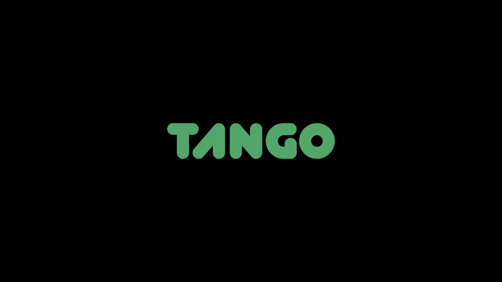

Tango is Cactus' distributed computation platform designed to execute heavy matrix operations, such as scaled matrix multiplication by partitioning tasks across multiple devices. It leverages a microservices architecture built in Go, with secure gRPC communication (using TLS) and stateless JWT authentication. It uses Zstd for compressing each matrix down to 40-50% of its original size. The platform is optimized for scalability, operational efficiency, and seamless integration with GCP. You should have an authourized service account JSON to test this. The codebase establishis a flexible foundation to support future distributed compute tasks beyond matrix multiplication.

## Why Go?

While C++ is renowned for its performance and control over system resources, it often comes with increased complexity in terms of memory management, concurrency handling, and overall development overhead. In contrast, Go offers a simplified and robust concurrency model with goroutines and channels that streamline parallel processing—a critical factor for a distributed computation platform like Tango. Go's garbage-collected runtime alleviates the need for manual memory management, reducing potential bugs and accelerating development. Go's ease of deployment through static binaries and strong standard library support for networking and microservices make it more suited for rapid development and scalable deployment compared to the intricate and often verbose nature of C++ programming.

Go's inherent concurrency model, based on goroutines and channels, is exceptionally well-suited for scaling to millions of concurrent communications and handling huge, frequently accessed task queues. Goroutines are lightweight compared to traditional OS threads, enabling the creation and management of millions of concurrent operations with minimal overhead (2kb). The Go runtime scheduler efficiently multiplexes these goroutines across available CPU cores, ensuring optimal resource utilization even under heavy loads. In the context of Tango, which requires handling high volumes of device communications and processing a large number of tasks concurrently, Go's non-blocking I/O and effective concurrency primitives facilitate rapid task distribution and response handling. Go's mature ecosystem, including high-performance networking libraries and support for gRPC, further enhances its ability to maintain low latency and high throughput. While achieving such scale necessitates careful system architecture—such as implementing efficient task queues, load balancing, and robust error handling—Go provides a solid foundation to build a resilient, scalable system capable of supporting millions of simultaneous connections and frequent task processing.

## Why gRPC?

gRPC was chosen over alternatives such as REST/HTTP, SOAP, and even GraphQL due to its superior performance and efficiency in bidirectional distributed systems. Unlike REST, which relies on text-based JSON payloads, gRPC uses Protocol Buffers, a compact binary format which significantly reduces bandwidth usage and improves latency. Cactus matrices and weights are stored as binaries inherently. gRPC natively supports bi-directional streaming and multiplexing, enabling real-time communication and efficient handling of multiple simultaneous requests, which is critical for a system like Tango that demands high concurrency. SOAP, while robust in enterprise environments, is overly verbose and cumbersome compared to gRPC. GraphQL, although flexible, is primarily designed for query optimization over HTTP rather than high-performance RPC. gRPC's low latency, efficient serialization, built-in code generation enables seamless integration in other languages and Go's concurrency model.

Pub/sub systems are excellent for decoupled, asynchronous messaging and event distribution, they were not selected for Tango due to the need for low-latency, synchronous interactions between the server and worker devices. In Tango, task assignments and immediate responses (such as task confirmations and result reporting) are crucial for effective job management. gRPC supports a request-response model that guarantees quick acknowledgments and direct communication, which is essential for coordinating distributed computation tasks. Pub/sub systems, on the other hand, are better suited for broadcasting events and handling high-volume data streams where eventual consistency is acceptable. Moreover, using pub/sub would introduce additional complexities, such as managing message ordering, ensuring exactly-once processing, and potentially increased latency in message delivery. Thus, gRPC's tightly coupled, bi-directional streaming capabilities make it a more fitting choice for Tango's synchronous task orchestration and real-time communication needs.

## Job Submission & Retreival

Consumers submit a job through a gRPC `SubmitTask` RPC. The job includes matrix data (A and B), the operation type, and parameters for task splitting. See `test/job_client.go` for a test submission flow. Each Job is a matmul op with two matrices of any size, and the desired number of split. The consumer device periodically polls Tango via the `JobStatus` RPC.
 Pooling is preferred at the scale Tango is expected to grow to, because it allows asynchronous processing and resource reuse without tying up a single long-lived connection. With pooling, tasks can be queued and processed independently for better fault tolerance, and manageability compared to holding a connection open until a job completes.  This way, clients can submit work and later retrieve results without blocking their connection, and the server can efficiently reuse connection resources across many tasks. Once done, the consumer device can retreive the result.

## Task Distribution

Tango uses a 2D sharding strategy to partition matrix operations:

- **Shard Calculation:**  
  - **Total Shards:** `ExpectedSplits = rowSplits * colSplits`
  - **Shard Indexing:**  
    - `rowBlock = (taskIndex - 1) / gridCols`  
    - `colBlock = (taskIndex - 1) % gridCols`
- **Determining Block Boundaries:**  
  - **Rows:**  
    - `startRow = rowBlock * rowsPerBlock + min(rowBlock, extraRows)`  
    - `endRow = startRow + rowsPerBlock` (incremented by 1 if extra rows are allocated)
  - **Columns:**  
    - `startCol = colBlock * colsPerBlock + min(colBlock, extraCols)`  
    - `endCol = startCol + colsPerBlock` (adjusted for extra columns)

Each device receives a pair of shards (one from matrix A and one from matrix B) to process. After computation, devices return their partial results, which are later reassembled into the final result matrix. Transaction logs are uploaded to GCP Cloud Storage. Additionally, devices use `Cactus Ferra`, a collection of linear algebra kernels, and report their executed floating point operations for payment determinations.

## Job Queues and Lifecycle

When a consumer submits a job (via the SubmitTask RPC), a new job object is created from the task request.  This job object encapsulates the complete task details, including the serialized matrices, operation type, and task-splitting parameters (such as the number of row and column splits).  The job is then stored in a central jobs map and appended to a job queue, which serves as an ordered list of pending jobs awaiting processing. Once jobs are queued, devices (workers) periodically poll the server for available tasks by invoking the FetchTask RPC.  The server iterates over the job queue and examines each job to determine if there is an available shard to assign. It uses a task reservation mechanism where, for each job, it checks if a shard is either unassigned or its previous assignment has timed out. If a shard is available, the system reserves it by updating the job's pending tasks with a new deadline and assigning that task shard to the requesting device. This ensures that each task (or shard) is processed only once and can be re-assigned in the event of a device failure or timeout. After a device processes its assigned shard, it reports the result back to the server using the ReportResult RPC. The job object is updated with the received shard result, and a counter (ReceivedUpdates) is incremented. When the number of received updates matches the total number of expected splits (derived from the product of row and column splits), the server considers the job complete. At this point, the server aggregates all the individual shard results into a final, complete result. Additionally, background processes, such as the task reaper, periodically clean up expired or unresponsive tasks to maintain the overall system’s robustness.

## Communication, Security & Compression

gRPC calls are secured with TLS, each communication to Tango muss use the provided TLS certificate, which is used to encrypt and decrypt the matrices in transit. JWT tokens are used to authenticate requests via a custom interceptor, each call must also present a JWT cactus-token in adition to TLS certificate. The TLS key and JWT signature for verifying both are stored on GCP secret manager, and only accessible with proper GCP env authentication. Zstd comppression is used to encode and decode the float32 binaries, this reduces matrices to between 40-50% of their original sizees. Zstd uses a more modern algorithm that provides higher compression ratios and faster compression speeds than GZip for many data types.  Zstd uses a blend of dictionary-based compression (similar to LZ77) and entropy coding (specifically Finite State Entropy) to achieve high compression ratios at very fast speeds. The algorithm is tunable, allowing you to choose between faster, lower-ratio compression and slower, higher-ratio compression. This versatility makes Zstd attractive for many applications where both performance and efficiency are critical.

## Key Performance Indicators (KPIs)

- **Task Throughput:** Number of tasks processed per unit time.
- **End-to-End Latency:** Time from job submission to final result aggregation.
- **Success Rate:** Percentage of tasks completed without errors.
- **Resource Utilization:** Metrics on CPU, memory, and network usage.
- **Security Metrics:** Frequency of authentication failures or unauthorized access attempts.
- **Error and Reassignment Rates:** Frequency of task timeouts or failures that require reassignment.

## Long-Term Vision and Future Expansions

- Expand beyond matrix multiplication to support other operations like convolutions or data transformations.
- Integrate with container orchestration platforms (e.g., Kubernetes) for auto-scaling based on workload.
- Develop advanced retry and self-healing mechanisms to improve reliability.
- Implement machine learning for predictive task scheduling, anomaly detection, and performance optimization.
- Explore integration with other cloud providers to enhance flexibility and reduce vendor lock-in.
- Build a dashboard for real-time monitoring, job management, and performance analytics.

## Project Setup and Deployment

### Install Go
1. Download and install from the [official Go website](https://golang.org/dl/).

### Build Protobuf (only when changes are made to tango.proto)
1. Make the build scripts executable with `chmod +x build.sh`
2. Rebuild the proto buffers `./build.sh`

### Running the Server locally
1. Fetch you service account API key json file form GCP, and save as `cactus-gcp-credentials.json` in the root.
2. Ensure you have insalled gcloud and then run `gcloud auth login`.
3. Make the build scripts executable with `chmod +x test.sh`
4. Build and run `./test.sh`

### Deploying to GCP Compute Engine
1. `docker build -t tango:latest .`
2. In addition to the previous section, ensure docker is istalled and then run `gcloud auth configure-docker`

### Deploying on a local server

1. `CGO_ENABLED=0 go build -ldflags="-s -w" -o tango .`
2. `sudo systemctl daemon-reload`
3. `sudo systemctl enable tango`
4. `sudo systemctl start tango`

## Contributing

- Fork and clone repository from GitHub, then CD into the directory.
- Each PR branch must have a separate branch and tested with `./test.sh`.
