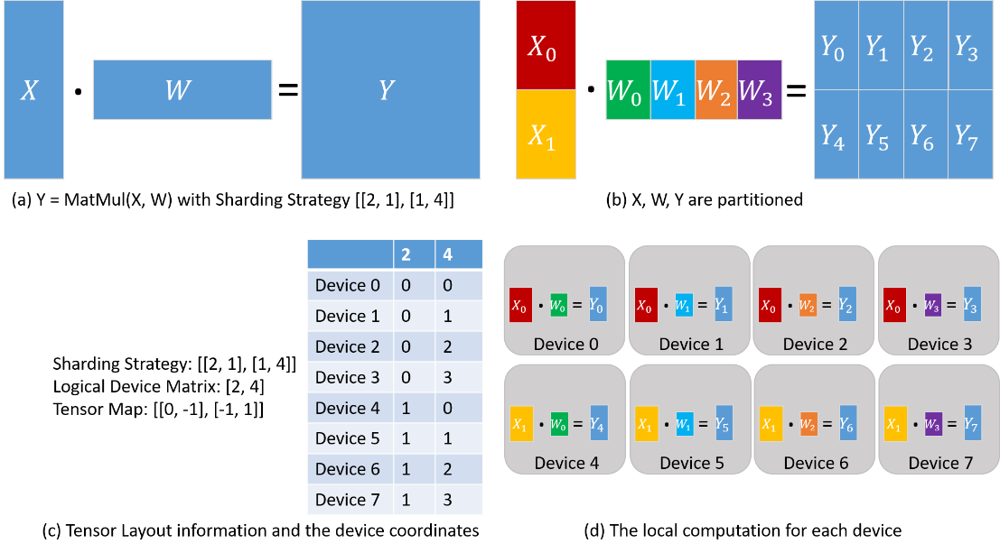

Tango is a distributed computation engine designed to execute heavy matrix operations, such as scaled matrix multiplication by partitioning tasks across multiple devices. 

It leverages a microservices architecture built in Go, with secure gRPC communication (using TLS) and stateless JWT authentication. It uses Zstd for compressing matrices, which can achieve significant size reduction (e.g., 40-50% has been observed). The platform is optimized for scalability, operational efficiency, and seamless integration with GCP. You should have an authourized service account JSON to test this. The codebase establishis a flexible foundation to support future distributed compute tasks beyond matrix multiplication.

## Why Go?

Go was chosen over alternatives like C++ for its simpler concurrency model (goroutines and channels), automatic memory management, and ease of deployment, which accelerate development for distributed systems. Go's lightweight goroutines (minimal overhead, e.g., 2KB each) and efficient runtime scheduler are well-suited for handling numerous concurrent device communications and tasks in Tango. Its support for non-blocking I/O and a mature ecosystem for networking and gRPC contribute to low latency and high throughput.

## Why gRPC?

gRPC was chosen over alternatives such as REST/HTTP, SOAP, and GraphQL due to its superior performance and efficiency. Unlike REST (text-based JSON), gRPC uses Protocol Buffers, a compact binary format reducing bandwidth and improving latency, suitable for Tango's binary matrix data. While gRPC supports advanced features like bi-directional streaming, Tango primarily utilizes its efficient unary RPCs for core request-response interactions (task submission, status polling, result reporting), ensuring low latency and clear communication patterns.

SOAP is overly verbose, and GraphQL is more for query optimization than high-performance RPC. gRPC's low latency, efficient serialization, and code generation aid integration and leverage Go's concurrency.

While pub/sub systems excel at asynchronous messaging, Tango's need for low-latency, synchronous interactions (like task assignments and immediate confirmations) makes gRPC's direct request-response model more suitable. This avoids potential complexities and latencies of pub/sub for Tango's core, tightly coupled task orchestration. Thus, gRPC's performance and direct communication capabilities make it a fitting choice.

## Job Submission & Retreival

Consumers submit a job through a gRPC `SubmitTask` RPC. The job includes matrix data (A and B), the operation type, and parameters for task splitting. See `test/job_client.go` for a test submission flow. Each Job is a matmul op with two matrices of any size, and the desired number of split. The consumer device periodically polls Tango via the `JobStatus` RPC.

Pooling is preferred at the scale Tango is expected to grow to, because it allows asynchronous processing and resource reuse without tying up a single long-lived connection. With pooling, tasks can be queued and processed independently for better fault tolerance, and manageability compared to holding a connection open until a job completes.  

This way, clients can submit work and later retrieve results without blocking their connection, and the server can efficiently reuse connection resources across many tasks. Once done, the consumer device can retreive the result.

## Task Distribution

Tango uses a 2D sharding strategy to partition matrix operations:

- **Shard Calculation:**  
  - **Total Shards:** `ExpectedSplits = rowSplits * colSplits`
  - **Shard Indexing:**  
    - `rowBlock = (taskIndex - 1) / gridCols`  
    - `colBlock = (taskIndex - 1) % gridCols`
- **Determining Block Boundaries:**  
  - **Rows:**  
    - `startRow = rowBlock * rowsPerBlock + min(rowBlock, extraRows)`  
    - `endRow = startRow + rowsPerBlock` (incremented by 1 if extra rows are allocated)
  - **Columns:**  
    - `startCol = colBlock * colsPerBlock + min(colBlock, extraCols)`  
    - `endCol = startCol + colsPerBlock` (adjusted for extra columns)

Each device receives a pair of shards (one from matrix A and one from matrix B) to process. After computation, devices return their partial results, which are later reassembled into the final result matrix. Transaction logs are uploaded to GCP Cloud Storage. 

## Job Queues and Lifecycle

When a consumer submits a job (via the SubmitTask RPC), a new job object is created from the task request.  This job object encapsulates the complete task details, including the serialized matrices, operation type, and task-splitting parameters (such as the number of row and column splits).  

The job is then stored in a central jobs map and appended to a job queue, which serves as an ordered list of pending jobs awaiting processing. Once jobs are queued, devices (workers) periodically poll the server for available tasks by invoking the FetchTask RPC.  

The server iterates over the job queue and examines each job to determine if there is an available shard to assign. It uses a task reservation mechanism where, for each job, it checks if a shard is either unassigned or its previous assignment has timed out. If a shard is available, the system reserves it by updating the job's pending tasks with a new deadline and assigning that task shard to the requesting device. 

This ensures that each task (or shard) is processed only once and can be re-assigned in the event of a device failure or timeout. After a device processes its assigned shard, it reports the result back to the server using the ReportResult RPC. The job object is updated with the received shard result, and a counter (ReceivedUpdates) is incremented. When the number of received updates matches the total number of expected splits (derived from the product of row and column splits), the server considers the job complete. At this point, the server aggregates all the individual shard results into a final, complete result. Additionally, background processes, such as the task reaper, periodically clean up expired or unresponsive tasks to maintain the overall system's robustness.

## Communication, Security & Compression

gRPC calls are secured with TLS, each communication to Tango muss use the provided TLS certificate, which is used to encrypt and decrypt the matrices in transit. JWT tokens are used to authenticate requests via a custom interceptor, each call must also present a JWT tango-token in adition to TLS certificate. 

The TLS key and JWT signature for verifying both are stored on GCP secret manager, and only accessible with proper GCP env authentication. Zstd compression is used to encode and decode the float32 binaries, which can reduce matrix data to 40-50% of its original size, based on observations. Zstd uses a more modern algorithm that provides higher compression ratios and faster compression speeds than GZip for many data types.  

Zstd uses a blend of dictionary-based compression (similar to LZ77) and entropy coding (specifically Finite State Entropy) to achieve high compression ratios at very fast speeds. The algorithm is tunable, allowing you to choose between faster, lower-ratio compression and slower, higher-ratio compression. This versatility makes Zstd attractive for many applications where both performance and efficiency are critical.

## Key Performance Indicators (KPIs)

- **Task Throughput:** Number of tasks processed per unit time.
- **End-to-End Latency:** Time from job submission to final result aggregation.
- **Success Rate:** Percentage of tasks completed without errors.
- **Resource Utilization:** Metrics on CPU, memory, and network usage.
- **Security Metrics:** Frequency of authentication failures or unauthorized access attempts.
- **Error and Reassignment Rates:** Frequency of task timeouts or failures that require reassignment.

## Long-Term Vision and Future Expansions

- Expand beyond matrix multiplication to support other operations like convolutions or data transformations.
- Integrate with container orchestration platforms (e.g., Kubernetes) for auto-scaling based on workload.
- Develop advanced retry and self-healing mechanisms to improve reliability.
- Implement machine learning for predictive task scheduling, anomaly detection, and performance optimization.
- Explore integration with other cloud providers to enhance flexibility and reduce vendor lock-in.
- Build a dashboard for real-time monitoring, job management, and performance analytics.

## Project Setup and Deployment

### Installations

1. Download and install Go from the [official Go website](https://golang.org/dl/).
2. Install `protoc` for building the protocol buffers with `brew install protobuf`

### Running the Server locally

1. Fetch you service account API key json file form GCP, and save as `gcp-credentials.json` in the root.
2. Set GCP auth env variable by running `export GOOGLE_APPLICATION_CREDENTIALS=gcp-credentials.json`
3. Update `config.yaml` with the accurate setups.
4. Ensure you have insalled gcloud and then run `gcloud auth login`.
5. Make the test scripts executable with `chmod +x test.sh`
6. Build and run `./test.sh`

### Deploying Tango instance

1. First, test locally as described in the test section 
2. Make the deploy scripts executable with `chmod +x deploy_device_simulator.sh`
3. Build and run `./deploy_device_simulator.sh`, which deploys to a static IP

### Deploying device simulator

1. First, test locally as described in the test section 
2. Make the deploy scripts executable with `chmod +x deploy.sh`
3. Build and run `./deploy.sh`, which deploys to a static IP
4. Run production test with `./test.sh --production`

###
1. Generating python proto: `protoc --python_out=. protobuff.proto`
2. Also run: `python3 -m grpc_tools.protoc -I. --python_out=. --grpc_python_out=. protobuff.proto` 

## Contributing

- Fork and clone repository from GitHub, then CD into the directory.
- Each PR branch must have a separate branch and tested with `./test.sh`.
